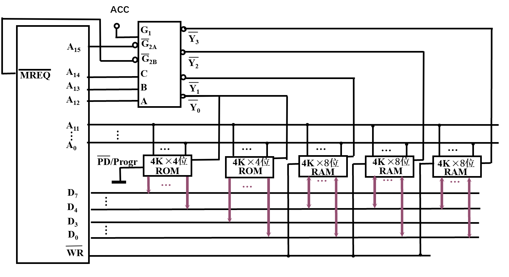

1. SRAM和DRAM不同的

	|              | DRAM | SRAM   |
	| ------------ | ---- | ------ |
	| 基本存储元件 | 电容 | 触发器 |
	| 集成度       | 高   | 低     |
	| 芯片引脚     | 少   | 多     |
	| 功耗         | 小   | 大     |
	| 价格         | 低   | 高     |
	| 速度         | 慢   | 快     |
	| 刷新         | 有   | 无     |

2. >* 集中刷新、分散刷新、分散刷新与集中刷新相结合（异步刷新）
   >* 由于电容中的电荷信息容易造成流失，为了保证电容中的信息得到保存，需要利用放大刷新器进行电容信息再生

3. >* 1110000
   >* 0011000

4. >* 6，1100110
   >* 7，1100110

5. >* 1片 4k x 8位 ROM，4片 4k x 8位 RAM
   >
   >* 片选逻辑图
   >
   >  
   >
   
6. >* 主存字块标记（TAG）：12位
   >
   >  组地址：7位
   >
   >  字块内地址：5位
   >
   >* 主存90个单元被分为12个字块，而Cache有128组，故访问前90号单元不会发生Cache行的替换
   >
   >  由于Cache初始状态为空，每一字块第一次访问时均不命中，后7轮访问均命中
   >
   >  90个单元对应了12个字块，第一轮访问有12次不命中，后7轮访问均命中
   >
   >  故重复8次的命中率为$\frac{90\times 8-12}{90\times 8}\times 100\%=98.3\%$
   >
   >* 设Cache的存取周期为t，主存存取后期为6t
   >
   >  直接从内存中访问数据所需时间为：$T_1=8\times 90\times 6t=4320t$
   >
   >  通过Cache访问数据所需时间为：$T_2=12\times 6t+(720-12)\times t=780t$
   >
   >  速度提升倍数为：$\frac{4320t}{780t}-1=4.54$
   >
   >* ABCDEFH的主存单元转化为2进制为1010 1011 1100 1101 1110 1111，根据主存字段划分将该存储单元地址化为 101010111100_1101111_01111，故该主存单元会被映射到Cache第1101111（111组）

7. >* 在直接映射方式下按字寻址，其主存的地址格式为
   >
   >  主存字块地址（TAG）：7位，Cache字块地址（INDEX）：9位，字块内地址：2位
   >
   >* 在四路组相联映射方式下按字寻址，其主存的地址格式为
   >
   >  主存字块地址（TAG）：9位，组地址：7位，字块内地址：2位
   >
   >* 在全相联映射方式下，其主存地址格式为
   >
   >  主存字块地址（TAG）：16位，字块内地址：2位

