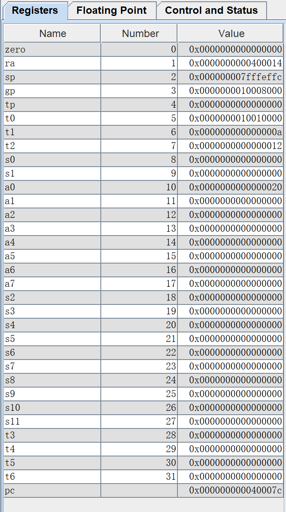

1. >cd
   >
   >12

2. >FEB5_0EE3

3. >* 1234_567A_BABE_FEF8
   >
   >* 2345_6781_2345_6780
   >
   >* 0000_0000_0000_0545
   
4. >2

5. >* 20
   >* 4N+1
   
6. >`sb x1, 1(x1)`

7. > * `add x31, x11, x31`
   >
   > * `ld x5, 0(x30)`
   >
   > * `addi x12, x30, -8`
   >
   > * `ld x30, 0(x12)`
   >
   > * `add x30, x5, x30`
   >
   > * `sd x30, 0(x31)`
  
8. >代码
   >
   >```pseudocode
   >.data      # 定义一个双字(dword)的10位数组
   >v:
   >    .dword 4,2,7,5,8,-9,11,32,20,18
   >    .space 10
   >
   >.text
   >
   >la, x5, v			# 将数组v基地址存入x5
   >addi x6, x0, 10 	# 将数组长度存入x6
   >ld x10, 0(x5)		# x10中先存入v[0]，作为临时最大值
   >jal ra, max			# 跳转到max函数
   >j Done
   >
   >max:
   >    addi sp, sp, -40 	# 在栈空间中开辟5个双字变量空间
   >    sd ra, 32(sp)    	# 保存x1的值（入栈）
   >    sd x22, 24(sp)      # 保存x22的值（入栈）
   >    sd x21, 16(sp)      # 保存x21的值（入栈） 
   >    sd x20, 8(sp)       # 保存x20的值（入栈）
   >    sd x19, 0(sp)       # 保存x19的值（入栈）
   >    mv x20, x5          # 复制x10中的值到x21
   >    mv x21, x6          # 复制x11中的值到x22
   >    li x19, 1           #  i = 1
   >Loop:
   >    bge x19, x21, Exit  # 当i < 10 时进入循环
   >    slli x22, x19, 3    # x22 = i * 8
   >    add x22, x22, x20   # x22 = v + i * 8
   >    ld x7, 0(x22)	# x7 = v[i]
   >    ble x7, x10, step	# if v[i] <= temp，则跳过更新x10
   >    mv x10, x7		# if v[i] > temp，则更新x10
   >step:
   >    addi x19, x19, 1	# i = i + 1
   >    j Loop		# 进入循环
   >Exit:    
   >    ld x19, 0(sp)	# 恢复x19(出栈)
   >    ld x20, 8(sp)	# 恢复x20(出栈)
   >    ld x21, 16(sp)	# 恢复x21(出栈)
   >    ld x22, 24(sp)	# 恢复x22(出栈)
   >    ld ra, 32(sp)	# 恢复ra(出栈)
   >    addi sp, sp, 40	# 恢复栈指针
   >    jalr x0, 0(ra)	# 返回调用线程
   >Done:
   >```
   >
   >程序截图
   >
   >

